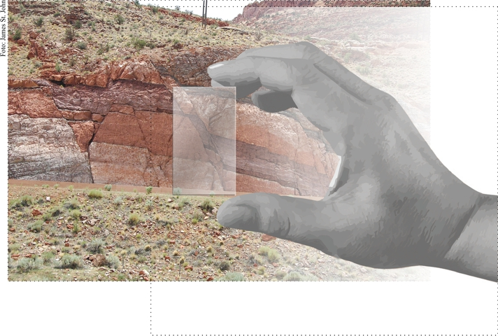

[](https://www.gnu.org/licenses/gpl-3.0)

# Fractal tools - A Python ArcGIS toolbox to calculate fractal dimensions
<p align="center">
  
</p>

> *During their earliest field training, geologists are taught to place an object of known size, such as a rock hammer or a lens cap, in photographs of outcrops in order to convey a sense of scale. Why?*</br>
> </br>
> *Christopher C. Barton and Paul R. La Pointe,*</br>
> **Fractals in the Earth Sciences**

## Background
This repository was created to share some of the scripts developed during the evolution of my Master's Degree dissertation, entitled:

> [Fractais e implicações para mapas de favorabilidade mineral: o exemplo dos depósitos iron oxide-copper-gold de Carajás (PA)](http://repositorio.unicamp.br/handle/REPOSIP/330385)

The repository contains three scripts used to perform the fractal analyses used in my dissertation. Each of the three scripts covers one method to determine the fractal dimension of geometric patterns:

* Box-counting fractal dimension (_D<sub>B</sub>_)
* Moving box-counting fractal dimension (_D<sub>B</sub>_)
* Radial-density fractal dimension (_D<sub>R</sub>_)

A review of how these methods work, and their application within the context of my dissertation can be found on the paper:

> [Spatial analysis of mineral deposit distribution: A review of methods and implications for structural controls on iron oxide-copper-gold mineralization in Carajás, Brazil](https://www.sciencedirect.com/science/article/pii/S0169136816302049).

## Looking under the hood
Each script presents a detailed header, which include the following sections:
```
###############################################
# Script name..:
# Created on...:
# Author.......:
# Purpose......:
# Use..........:
# Requirements.:
# History......:
###############################################
# Main input:
# Main output:
# How does this script work?
###############################################
```
The header contains abundant information about the script logic, expected inputs and outputs, etc. Scripts are also abundantly commented, to try to guide the reader on each step of the analysis.

> **Note**: Unfortunately, this being one of my first practical applications in developing ArcGIS tools, I did not record the specific versions of each dependency in the environment where scripts were run.
> But it is worth mentioning that the libraries used were from the newest versions available around the time these tools were developed, _i.e._, between the end of 2015 and the beginning of 2016.</br>
> Additionally, I would like to point out that these scripts are being made public with only minor alterations in comparison when they were originally written (with the exception of cosmetic changes to better conform to [PEP8 conventions](https://www.python.org/dev/peps/pep-0008/)). **As such, it is probable that they need to be adapted if one wants to use them in newer versions of ArcMap or ArcGIS Online**.

## Getting your hands dirty
This repository also contains a **FractalTools** toolbox file (`.tbx`), used to import the scripts within ArcMap, and run them with ease (for importing instructions, see this [video tutorial](https://www.youtube.com/watch?v=y4cwwlXQQJ0)). To use it, one has to download all scripts and the toolbox file, and save them all on the same directory.

After import, the user will have at disposal a toolbox called **Fractal Tools**, with each script available as an individual tool.

> **Note**: The toolbox file is only compatible with ArcGIS 10.3 or newer.
